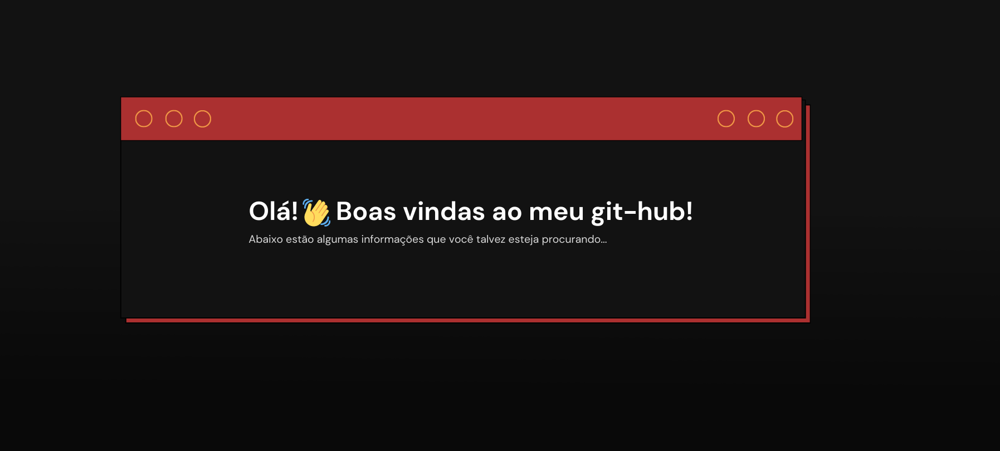

<!-- card de boas vindas -->

<head>
  <link rel="stylesheet" href="https://cdn.jsdelivr.net/gh/devicons/devicon@v2.15.1/devicon.min.css">
</head>

<!-- https://devicon.dev -->

## Quem sou eu? 
> Oi! Meu nome é Fernando, sou estudante explorando linguagens variadas, mas se focando principalmente em front-end. Meu perfil logo estará com alguns projetos interessantes.

> Procurando contato? tente meu e-mail: fernandogabMG@gmail.com

## Linguagens:

  

## Geral:

